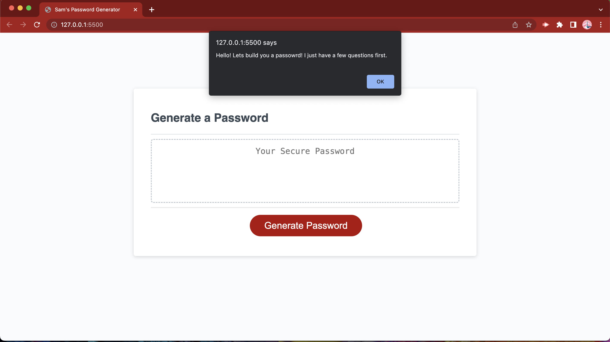

# Sam's Password Generator

## Description

I created this application as a way to generate new passwords based on criteria that users can choose. This takes away any need to think about a new password when the password you use for everything else doesn't fit the requirements of a new password you may need to create in the future!

## Usage

THIS APPLICATION DOES NOT CURRENT FUNCTION AS DESIRED

Users load the page, click the generate button, answer the prompts, and then copy the password that is created. 

In its current state, users experience everything up to the final password creation.

## Credits

I used stackoverflow while troubleshooting the characterOptions array creation
https://stackoverflow.com/questions/1374126/how-to-extend-an-existing-javascript-array-with-another-array-without-creating

I used stackoverflow while troublshooting prompt() validation methods
https://stackoverflow.com/questions/23097859/javascript-prompt-validation